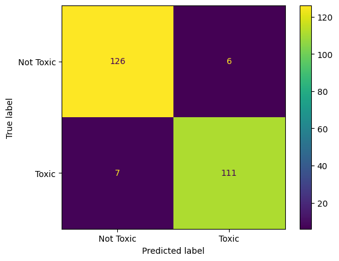

# Integrate with sklearn

Using this SDK, you can easily pull down the data from Nyckel, and analyze it using sklearn, or any other library you'd like.

```python
from nyckel import TextClassificationFunction, Credentials

credentials = Credentials(client_id = "", client_secret = "")

function_id = ""
func = TextClassificationFunction(function_id, credentials)
samples = func.list_samples()
samples = [s for s in samples if s.annotation] # Only keep annotated samples
samples = [s for s in samples if s.prediction] # Only keep predicted samples
y_true = [s.annotation.label_name for s in samples]
y_pred = [s.prediction.label_name for s in samples]

# From here, you can use any of the sklearn metrics you'd like. For example:

from sklearn.metrics import confusion_matrix, ConfusionMatrixDisplay
cm = ConfusionMatrixDisplay.from_predictions(y_true, y_pred)
```

For example, this is the confusion matrix for our public [IsToxic](https://www.nyckel.com/pretrained-classifiers/toxic-language-identifier/) function


